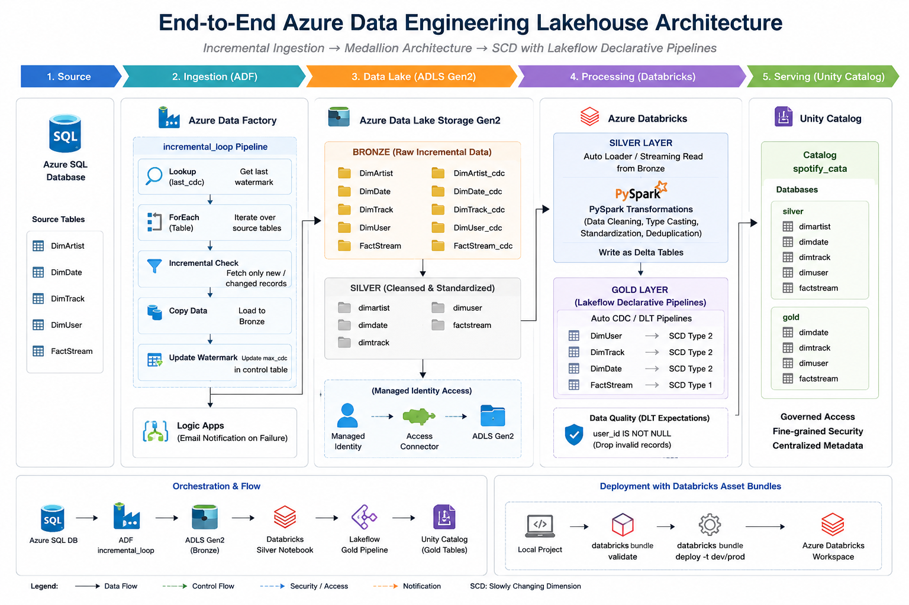
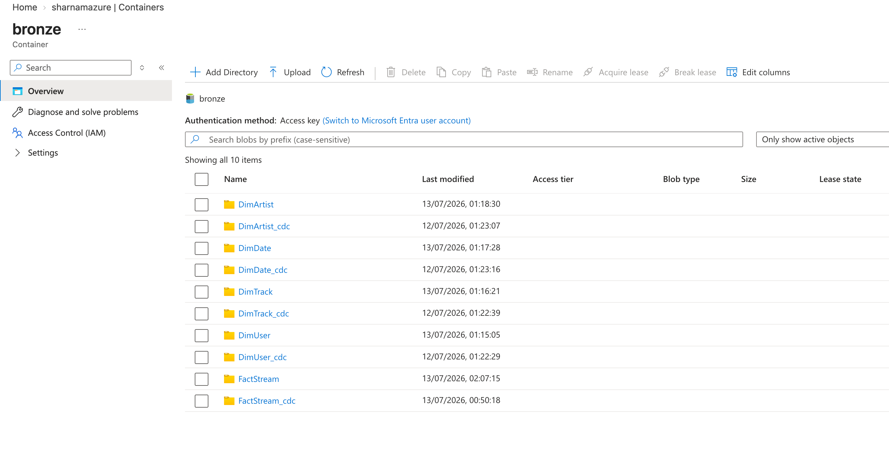
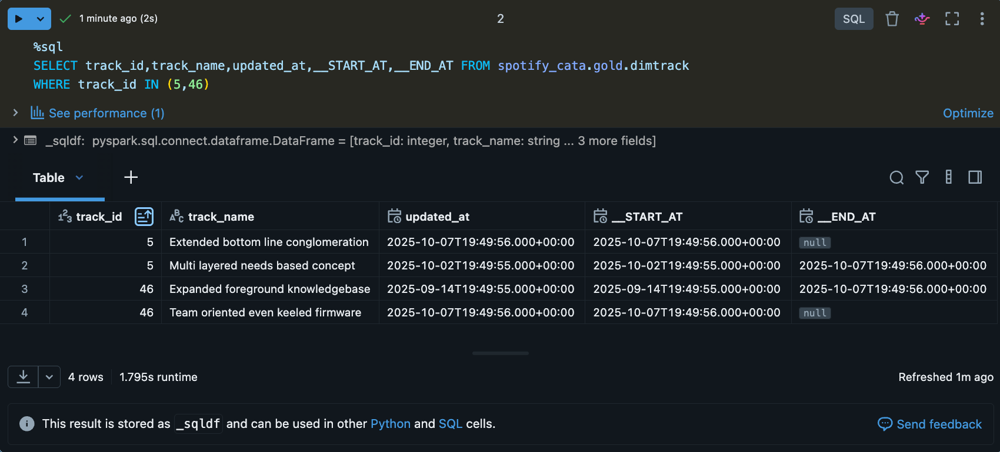
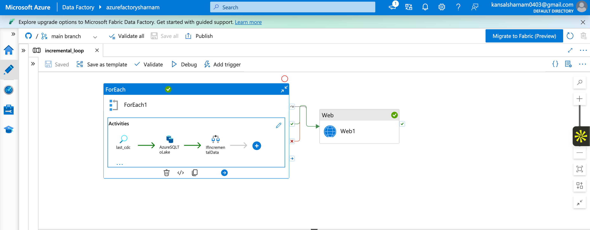
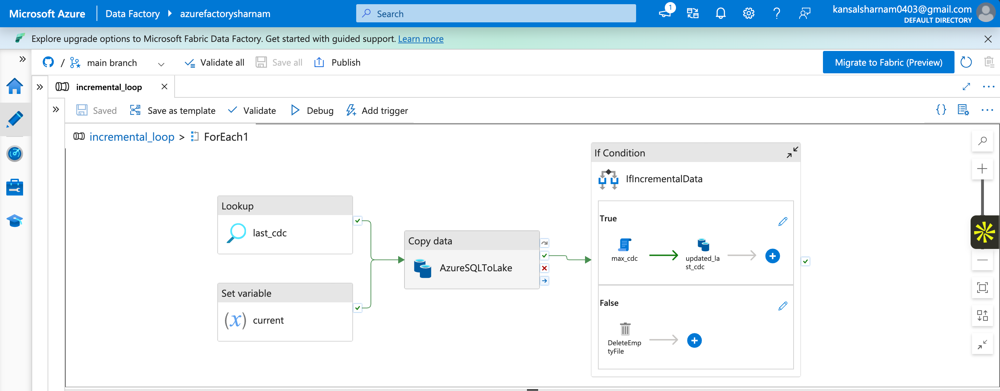
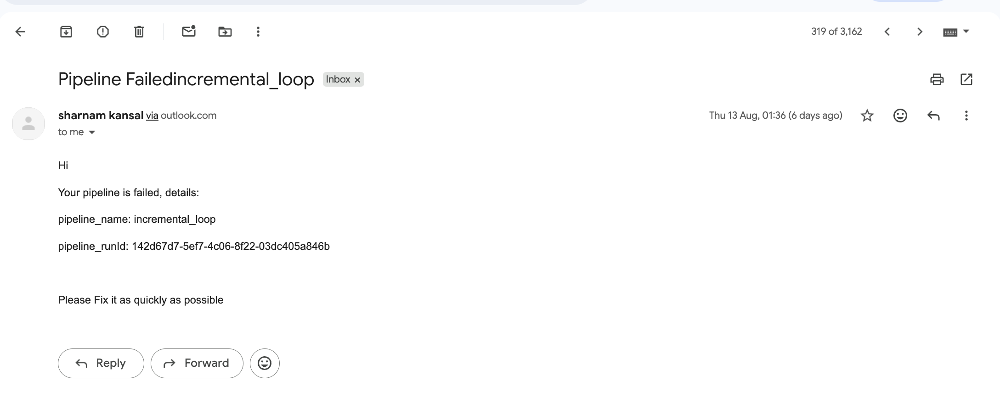
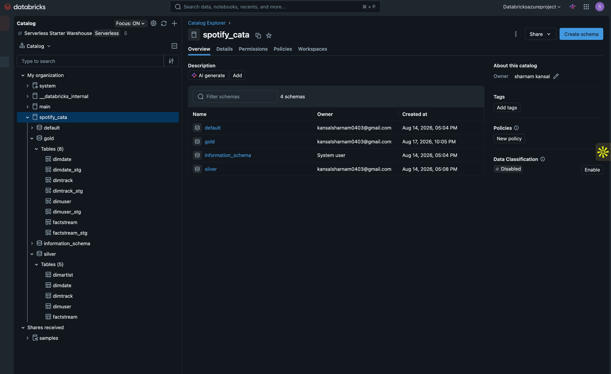
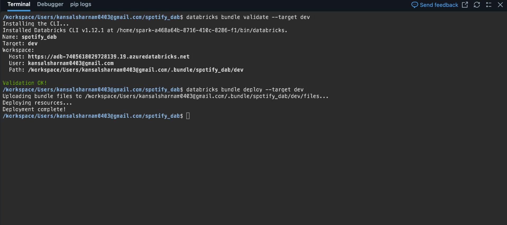
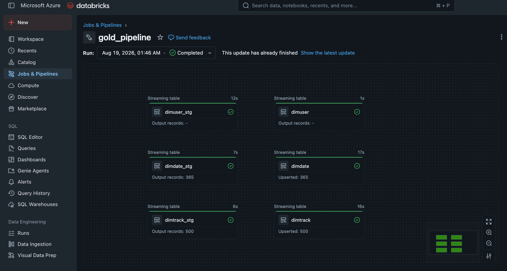

# 🎵 End-to-End Azure Data Engineering Lakehouse

> **A production-style Azure Data Engineering project** implementing metadata-driven incremental ingestion, Medallion Architecture, Databricks Auto Loader, Delta Lake, Unity Catalog, Lakeflow Declarative Pipelines, SCD Type 1/2, data quality validation, Jinja-driven ELT, and Databricks Asset Bundles.

[](https://azure.microsoft.com/)
[](https://azure.microsoft.com/products/data-factory)
[](https://azure.microsoft.com/products/databricks)
[](https://delta.io/)
[](https://spark.apache.org/docs/latest/api/python/)
[](https://docs.databricks.com/aws/en/data-governance/unity-catalog/)
[](https://docs.databricks.com/aws/en/ldp/)
[](https://jinja.palletsprojects.com/)

---

## 📌 Project Overview

This project demonstrates an end-to-end cloud data engineering solution for a Spotify-style analytics workload.

The pipeline starts with relational source data in **Azure SQL Database**, uses **Azure Data Factory (ADF)** to perform metadata-driven incremental ingestion into **ADLS Gen2 Bronze**, processes and standardizes the data in **Azure Databricks Silver**, and builds analytics-ready **Gold** dimensions and facts using **Lakeflow Declarative Pipelines**.

The project also demonstrates:

- Watermark-based incremental ingestion
- Metadata-driven ADF orchestration
- Medallion Architecture
- Auto Loader for incremental file discovery
- PySpark transformations
- Delta Lake
- Unity Catalog
- Azure Managed Identity + Access Connector
- External Locations
- Lakeflow Auto CDC
- SCD Type 2 for dimensions
- SCD Type 1 for facts
- Data quality expectations
- Jinja-based dynamic SQL / ELT
- Logic Apps notifications
- Databricks Asset Bundles for deployment
- Incremental change testing and SCD2 validation

> **Note:** This project is focused on Data Engineering and Lakehouse implementation. No Power BI layer is included; the Gold layer is the final analytics-ready output.

---

## 🏗️ Architecture

### High-Level Architecture

```text
                              ┌─────────────────────────┐
                              │     Azure SQL Database  │
                              │                         │
                              │ DimArtist               │
                              │ DimDate                 │
                              │ DimTrack                │
                              │ DimUser                 │
                              │ FactStream              │
                              └────────────┬────────────┘
                                           │
                                           │ Incremental
                                           │ ingestion
                                           ▼
                              ┌─────────────────────────┐
                              │   Azure Data Factory    │
                              │                         │
                              │  incremental_loop       │
                              │  • Metadata driven      │
                              │  • Lookup watermark     │
                              │  • ForEach tables       │
                              │  • Incremental query    │
                              │  • Copy to Bronze       │
                              │  • Update watermark     │
                              └────────────┬────────────┘
                                           │
                                           ▼
                              ┌─────────────────────────┐
                              │       ADLS Gen2         │
                              │                         │
                              │        BRONZE           │
                              │   Raw incremental data  │
                              └────────────┬────────────┘
                                           │
                                  Auto Loader /
                                  Streaming Read
                                           │
                                           ▼
                              ┌─────────────────────────┐
                              │    Azure Databricks     │
                              │                         │
                              │        SILVER           │
                              │  PySpark + Delta Lake   │
                              │                         │
                              │ DimArtist               │
                              │ DimDate                 │
                              │ DimTrack                │
                              │ DimUser                 │
                              │ FactStream              │
                              └────────────┬────────────┘
                                           │
                                           ▼
                    ┌─────────────────────────────────────────┐
                    │   Lakeflow Declarative Pipelines        │
                    │                                         │
                    │                 GOLD                    │
                    │                                         │
                    │ DimUser       → SCD Type 2              │
                    │ DimTrack      → SCD Type 2              │
                    │ DimDate       → SCD Type 2              │
                    │ FactStream    → SCD Type 1              │
                    │                                         │
                    │ Data Quality Expectations + Auto CDC    │
                    └───────────────────┬─────────────────────┘
                                        │
                                        ▼
                              ┌─────────────────────────┐
                              │      Unity Catalog      │
                              │                         │
                              │ Catalog: spotify_cata   │
                              │ ├── silver              │
                              │ └── gold                │
                              └─────────────────────────┘


   Security / Governance
   ──────────────────────
   Azure Managed Identity
          ↓
   Databricks Access Connector
          ↓
   Azure RBAC
          ↓
   ADLS Gen2


   Deployment
   ──────────
   Databricks Asset Bundle
          ↓
   Validate → Deploy → Databricks Workspace
```

### 📷 Architecture Diagram



---

## 🔄 End-to-End Data Flow

The pipeline is implemented as a sequence of stages:

```text
1. Azure SQL
       ↓
2. ADF incremental_loop
       ↓
3. ADLS Gen2 Bronze
       ↓
4. Databricks Silver Notebook
       ↓
5. Silver Delta Tables
       ↓
6. Lakeflow Gold Pipeline
       ↓
7. Gold SCD1 / SCD2 Tables
```

For the current implementation, these stages are executed sequentially:

1. Run the ADF incremental pipeline.
2. Verify the new data in Bronze.
3. Run the Silver Databricks notebook.
4. Verify the Silver Delta tables.
5. Run the Gold Lakeflow pipeline.
6. Validate the Gold output and SCD history.

> **Current orchestration note:** ADF, Silver processing, and the Gold Lakeflow pipeline are implemented as separate stages. The next natural enhancement would be to orchestrate the downstream Databricks stages from the upstream workflow.

---

## 🧱 Medallion Architecture

### 🥉 Bronze Layer

The Bronze layer stores the raw/incremental data ingested from Azure SQL into ADLS Gen2.



Current Bronze datasets:

```text
bronze/
├── DimArtist/
├── DimArtist_cdc/
├── DimDate/
├── DimDate_cdc/
├── DimTrack/
├── DimTrack_cdc/
├── DimUser/
├── DimUser_cdc/
├── FactStream/
└── FactStream_cdc/
```

The Bronze layer is intentionally close to the source, providing a reliable foundation for downstream transformations.

---

### 🥈 Silver Layer

The Silver layer is implemented in Azure Databricks using PySpark, streaming reads, Auto Loader and Delta Lake.


Current Silver tables:

```text
spotify_cata.silver
├── dimartist
├── dimdate
├── dimtrack
├── dimuser
└── factstream
```

Typical Silver processing includes:

- Reading new Bronze files incrementally with Auto Loader
- Schema handling
- Column transformations
- Standardization / cleansing
- Writing transformed data as Delta tables

#### Example Auto Loader pattern

```python
df_user = (
    spark.readStream
        .format("cloudFiles")
        .option("cloudFiles.format", "parquet")
        .option(
            "cloudFiles.schemaLocation",
            "abfss://silver@<storage-account>.dfs.core.windows.net/DimUser/checkpoint"
        )
        .load(
            "abfss://bronze@<storage-account>.dfs.core.windows.net/DimUser"
        )
)
```

A separate streaming checkpoint is used when writing the streaming result to Silver.

---

## 🥇 Gold Layer

The Gold layer contains business-ready dimension and fact tables managed through **Lakeflow Declarative Pipelines**.

Current Gold tables:

```text
spotify_cata.gold
├── dimdate
├── dimtrack
├── dimuser
└── factstream
```

### Slowly Changing Dimension Strategy

| Gold Table   | Strategy   | Purpose                                               |
|--------------|------------|--------------------------------------------------------|
| `DimUser`    | SCD Type 2 | Preserve historical versions of user attributes        |
| `DimTrack`   | SCD Type 2 | Preserve historical versions of track attributes       |
| `DimDate`    | SCD Type 2 | Maintain versioned dimension records                   |
| `FactStream` | SCD Type 1 | Maintain the latest state without historical versions   |

---

## 🔁 SCD Type 2 with Lakeflow Auto CDC

For the dimension tables, Lakeflow Auto CDC is used to process changes and maintain historical versions.

Example pattern used for `DimTrack`:

```python
import dlt

@dlt.table
def dimtrack_stg():
    df = spark.readStream.table(
        "spotify_cata.silver.dimtrack"
    )
    return df


dlt.create_streaming_table("dimtrack")

dlt.create_auto_cdc_flow(
    target="dimtrack",
    source="dimtrack_stg",
    keys=["track_id"],
    sequence_by="updated_at",
    stored_as_scd_type="2"
)
```

### How the SCD2 process works

When a tracked dimension record changes:

```text
Incoming change
      ↓
Match using business key
      ↓
Expire previous version
      ↓
Insert new version
      ↓
Keep new version as current record
```

Lakeflow automatically maintains:

```text
__START_AT
__END_AT
```

For example:

```text
track_id | track_name (old)  | __START_AT          | __END_AT
---------|-------------------|---------------------|-------------------
46       | Previous Name     | 2025-09-14...        | 2025-10-07...

track_id | track_name (new)  | __START_AT          | __END_AT
---------|-------------------|---------------------|-------------------
46       | New Name          | 2025-10-07...        | NULL
```

This was validated by introducing new/changed source records and confirming the historical and current versions in Gold.

### 📷 SCD Type 2 Validation



---

## 🔄 SCD Type 1 for FactStream

`FactStream` uses SCD Type 1 so that the target maintains the latest version of a record without maintaining historical versions in the same way as the dimensions.

The Gold model therefore follows:

```text
Dimensions → historical tracking with SCD2
Fact       → latest-state processing with SCD1
```

---

## ✅ Data Quality

Lakeflow data quality expectations are implemented in the Gold layer.

Current expectation for `DimUser`:

```python
expectations = {
    "rule_1": "user_id IS NOT NULL"
}
```

Records that violate this rule are dropped using:

```python
@dlt.expect_all_or_drop(expectations)
```

### Validation Flow

```text
Silver DimUser
      ↓
Quality expectation
      ↓
user_id IS NOT NULL
      ↓
Valid records → Gold
Invalid records → Dropped
```

This demonstrates that data quality rules can be enforced as part of the transformation pipeline rather than as a separate manual validation step.

---

## 🔄 Azure Data Factory Incremental Ingestion

### Metadata-Driven Design

The ingestion process is designed to process multiple source tables using a reusable configuration rather than creating an individual pipeline for every table.

The configuration contains information such as:

```json
[
  {
    "schema": "dbo",
    "table": "DimUser",
    "cdc_col": "updated_at"
  },
  {
    "schema": "dbo",
    "table": "DimTrack",
    "cdc_col": "updated_at"
  },
  {
    "schema": "dbo",
    "table": "DimDate",
    "cdc_col": "date"
  },
  {
    "schema": "dbo",
    "table": "DimArtist",
    "cdc_col": "updated_at"
  },
  {
    "schema": "dbo",
    "table": "FactStream",
    "cdc_col": "stream_timestamp"
  }
]
```

The main pipeline is:

```text
incremental_loop
      ↓
Lookup previous watermark
      ↓
ForEach source table
      ↓
Build parameterized incremental query
      ↓
Copy new/changed records to Bronze
      ↓
Check whether incremental data exists
      ↓
Find maximum processed CDC value
      ↓
Update the stored watermark
```

This avoids maintaining separate ingestion logic for every table.

### Initial Watermark

The project starts with a baseline CDC value such as:

```json
{
  "cdc": "1900-01-01"
}
```

After successful ingestion, the watermark is advanced to the latest processed value.

### 📷 ADF Incremental Pipeline




---

## 📬 Logic Apps Notifications

Azure Logic Apps are connected after the Bronze ingestion/copy stage for notification handling.

High-level flow:

```text
ADF Incremental Ingestion
          ↓
   Copy / ingestion
          ↓
Logic App notification
```

This provides an operational notification mechanism around the ingestion workflow.

### 📷 Logic Apps / Notification Screenshot



---

## 🔐 Security & Governance

### Unity Catalog

Unity Catalog is used as the central governance layer.

Current structure:

```text
Metastore
└── spotify_cata
    ├── silver
    │   ├── dimartist
    │   ├── dimdate
    │   ├── dimtrack
    │   ├── dimuser
    │   └── factstream
    │
    └── gold
        ├── dimdate
        ├── dimtrack
        ├── dimuser
        └── factstream
```

Unity Catalog provides a consistent namespace and access-control layer for the Databricks data assets.

### 📷 Unity Catalog Screenshot



---

### Azure Managed Identity + Access Connector

Databricks accesses ADLS Gen2 using an Azure Databricks Access Connector and Managed Identity rather than embedding storage account keys in notebooks.

Conceptually:

```text
Azure Databricks
       ↓
Access Connector
       ↓
Managed Identity
       ↓
Azure RBAC
       ↓
ADLS Gen2
```

The implementation uses Azure RBAC roles to grant the required storage and file-event permissions.

---

### External Locations

Unity Catalog external locations provide governed access to ADLS Gen2 storage paths using the configured storage credential.

Storage access was validated for operations including:

- Read
- List
- Write
- Delete
- Path Exists
- Hierarchical Namespace

---

## 🧩 Jinja-Driven ELT

The Gold transformation logic also includes a metadata-driven Jinja approach for dynamically generating SQL joins.

Instead of hardcoding the entire query, table metadata is supplied through a Python structure and rendered into SQL.

Example concept:

```text
Parameters
    ↓
Jinja template
    ↓
Dynamic SQL
    ↓
FactStream + Dimensions
    ↓
Gold transformation
```

Example generated query pattern:

```sql
SELECT
    factstream.stream_id,
    factstream.listen_duration,
    dimuser.user_id,
    dimuser.user_name,
    dimtrack.track_id,
    dimtrack.track_name
FROM spotify_cata.silver.factstream AS factstream
LEFT JOIN spotify_cata.silver.dimuser AS dimuser
    ON factstream.user_id = dimuser.user_id
LEFT JOIN spotify_cata.silver.dimtrack AS dimtrack
    ON factstream.track_id = dimtrack.track_id;
```

This demonstrates reusable, configuration-driven ELT logic.

---

## 🚀 Databricks Asset Bundles

The Databricks implementation is packaged as a **Databricks Asset Bundle** for repeatable deployment.

Bundle structure:

```text
databricks/
├── databricks.yml
├── resources/
│   ├── sample_job.job.yml
│   └── spotify_dab_etl.pipeline.yml
├── src/
│   ├── silver/
│   │   └── silver_dimensions.py
│   ├── gold/
│   │   └── dlt/
│   │       └── transformations/
│   │           ├── DimDate.py
│   │           ├── DimTrack.py
│   │           ├── DimUser.py
│   │           └── Factstream.py
│   └── jinja/
│       └── jinja_notebook.py
├── utils/
├── requirements.txt
└── pyproject.toml
```

Typical deployment workflow:

```bash
databricks bundle validate --target dev
databricks bundle deploy --target dev
```

The project contains development and production deployment targets.

The bundle provides a version-controlled deployment definition for the Databricks workloads and resources.

### 📷 Databricks Asset Bundle Deployment



---

## 🧪 Testing & Validation

A deliberate incremental-change test was performed to validate the end-to-end pipeline.

### Test approach

1. Source SQL data was changed/extended.
2. Primary-key constraints were temporarily relaxed for controlled duplicate-key testing.
3. ADF incremental ingestion was executed.
4. New data was written to Bronze.
5. Silver transformations were executed.
6. Gold Lakeflow pipeline was executed.
7. SCD Type 2 behavior was validated in Gold.

### Example Result

For changed `DimTrack` records, the Gold table correctly maintained:

```text
Old version
    ↓
__END_AT populated

New version
    ↓
__START_AT populated
__END_AT = NULL
```

The Lakeflow pipeline also showed successful processing of changed records, including upsert activity in `DimTrack`.

> **Important:** Source primary-key constraints were removed only temporarily for testing duplicate-key scenarios. They should be restored or otherwise documented according to the intended source-system design.

### 📷 Pipeline Run Screenshot



---

## 📁 Repository Structure

```text
azure-data-engineering-project/
│
├── adf/
│   ├── dataset/
│   ├── factory/
│   ├── linkedService/
│   ├── pipeline/
│   └── publish_config.json
│
├── databricks/
│   ├── databricks.yml
│   ├── resources/
│   ├── src/
│   │   ├── silver/
│   │   ├── gold/
│   │   └── jinja/
│   ├── utils/
│   ├── requirements.txt
│   └── pyproject.toml
│
├── docs/
│   ├── architecture/
│   └── screenshots/
│
├── sql/
│
├── .gitignore
└── README.md
```

---

## ▶️ How to Run the Project

The current project is intentionally split into separate processing stages.

### Step 1 — Run ADF

Run:

```text
ADF → incremental_loop
```

This:

- Reads the latest watermark
- Iterates through configured source tables
- Executes incremental extraction
- Writes new/changed data to ADLS Bronze
- Updates the watermark

Verify the Bronze files.

---

### Step 2 — Run Silver Processing

Run the Databricks Silver notebook/job.

Conceptually:

```text
Bronze
  ↓
Auto Loader
  ↓
PySpark transformations
  ↓
Silver Delta tables
```

Verify:

```text
spotify_cata.silver
├── dimartist
├── dimdate
├── dimtrack
├── dimuser
└── factstream
```

---

### Step 3 — Run Gold Lakeflow Pipeline

Run:

```text
gold_pipeline
```

This processes Silver data into the Gold layer and applies:

- Auto CDC
- SCD Type 2
- SCD Type 1
- Data quality expectations

Verify:

```text
spotify_cata.gold
├── dimdate
├── dimtrack
├── dimuser
└── factstream
```

---

## 🔭 Future Improvements

The current implementation intentionally focuses on the core Data Engineering workflow. Potential next improvements include:

- Orchestrating ADF → Silver → Gold as a single end-to-end workflow
- Adding more data-quality expectations
- Adding automated data reconciliation / row-count checks
- Implementing CI/CD promotion from development to production
- Adding monitoring dashboards and alerting
- Adding automated unit/integration tests
- Adding schema-change handling and stronger data contracts

---

## 💡 Key Engineering Concepts Demonstrated

This project demonstrates practical experience with:

- **Incremental data ingestion**
- **Metadata-driven pipeline design**
- **Watermark / CDC-based processing**
- **Azure Data Factory**
- **ADLS Gen2**
- **Medallion Architecture**
- **Azure Databricks**
- **PySpark**
- **Auto Loader**
- **Delta Lake**
- **Unity Catalog**
- **Azure Managed Identity**
- **Access Connector**
- **External Locations**
- **Lakeflow Declarative Pipelines**
- **Auto CDC**
- **SCD Type 1**
- **SCD Type 2**
- **Data Quality Expectations**
- **Jinja / dynamic SQL**
- **Logic Apps**
- **Databricks Asset Bundles**
- **Incremental testing and validation**

---

## 🧠 Interview Explanation

### In 30 seconds

> I built an end-to-end Azure data engineering lakehouse pipeline using Azure SQL, Azure Data Factory, ADLS Gen2 and Databricks. ADF performs metadata-driven incremental ingestion into the Bronze layer using watermarks. Databricks Auto Loader processes Bronze files into Silver Delta tables using PySpark. For Gold, I use Lakeflow Declarative Pipelines with Auto CDC, implementing SCD Type 2 for DimUser, DimTrack and DimDate and SCD Type 1 for FactStream. I also implemented data quality expectations, Unity Catalog governance, Managed Identity-based storage access, Jinja-driven ELT, Logic Apps notifications and Databricks Asset Bundles for deployment.

### If asked "Why this architecture?"

> The architecture separates ingestion, transformation and business-ready data into clear layers. Incremental ingestion reduces unnecessary source reads and data movement, Bronze preserves the incoming data, Silver provides cleaned Delta-based datasets, and Gold contains analytics-ready dimensions and facts with appropriate historical processing.

### If asked "How is the pipeline executed?"

> At the current stage, I run the workflow sequentially: ADF performs incremental ingestion into Bronze, the Silver Databricks notebook processes the Bronze data, and the Gold Lakeflow pipeline processes the Silver tables. The next improvement would be to orchestrate those stages end-to-end.

---

## 👨‍💻 Author

**Sharnam Kansal**
Data Engineer | Azure | Databricks | PySpark | SQL | Data Factory

[GitHub](https://github.com/sharnam04)
